# ICS4U - CPT: Interactive Data Visualization

# About this data set

## What is this data set?

This data set is a snapshot of the Tetra League ([TETR.IO](https://tetr.io)'s ranked mode) leaderboard on January 17th 2025, at around 9:00pm. This data set was taken from the [official tetr.io API](https://tetr.io/about/api/), scraped using an edited version of [dan63's](https://github.com/dan63047/) [beanserver blaster](https://ts.dan63.by/beanserver_blaster/index.js).

## What does this data set include?

This data set includes a csv with the following categories:

* Username
* Tetra Rating/TR (the game's version of rating points, from 1-25000)
* Rank [breakdown here](https://ch.tetr.io/league/)
* Glicko
* Reliability Deviation
* Attack Per Minute (APM)
* Pieces Per Second (PPS)
* [VS score](https://tetrio.team2xh.net/?t=faq#vs)

## Why did I choose this data set 

As someone who has a passion for this game, I thought it would be interesting to be able to visualize plots of people's stats. 

# Object Oriented Approach

## Methods

### Main (cpt.java)

Main file, pretty much just passes values through other classes and gets the final product. Notable things: creates the final layout, chooses the csv file to load, that's about it

Uncomment line 56 to use the big dataset (47084 entries) instead of the small one (4708 entries)

### Player Class

Each line of the csv file is one of these objects. Includes username, tr, rank, glicko, rd, apm, pps, vs as variables, and getter methods for each one.

### DataManager

Converts the csv file into an arraylist of players.

### Chart Manager

Handles converting the arraylist of players into datapoints, creating the graph, updating the graph, and tooltips on point hover.

### UI Manager

Handles the dropdown logic, creates the custom legend, and the vbox arranging related to the combobox

### UML

### JavaFX Installation & Configuration
The [INSTALL.md](INSTALL.md) in this repository includes instructions on how to set up JavaFX for your development environment.
